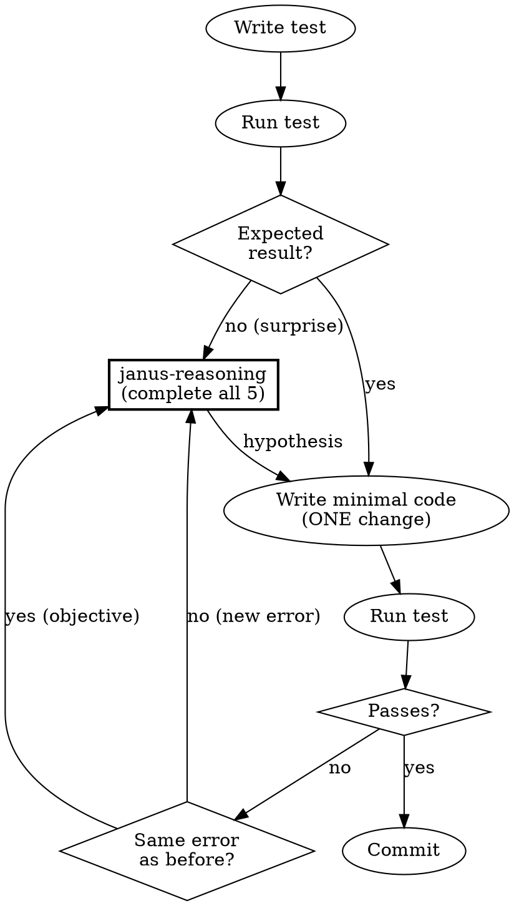
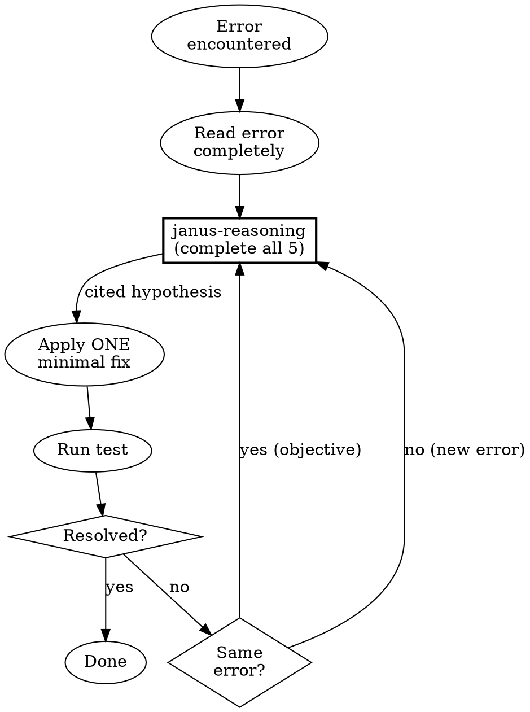

# Janus Superpowers Integration Design

**Date:** 2025-12-30
**Status:** Ready for implementation

## Overview

Integrate the Janus bidirectional reasoning paradigm into superpowers as the core development methodology. Forces Claude to do explicit symbolic reasoning (logic, constraints, derivations) alongside semantic reasoning (pattern matching) when confused.

**Core insight:** Derive hypotheses from evidence and logic. Do not guess.

## Changes Summary

| Skill | Status | Purpose |
|-------|--------|---------|
| `janus-reasoning` | NEW | Forced bidirectional reasoning protocol when confused |
| `janus-interop` | NEW | Safety checklist for Prolog/Python execution |
| `using-superpowers` | MODIFY | Add Janus paradigm framing |
| `test-driven-development` | MODIFY | Add confusion triggers → janus-reasoning |
| `systematic-debugging` | MODIFY | Replace guessing with derived hypotheses |

---

## New Skill: `janus-reasoning`

```yaml
---
name: janus-reasoning
description: Use when confused during TDD or debugging - forces bidirectional reasoning before next attempt
---
```

### Triggers

| Trigger | Type |
|---------|------|
| Test result doesn't match expectation | Self-assessed |
| Second failed fix attempt | Self-assessed |
| Can't decide between approaches | Self-assessed |
| Same error message twice in a row | Objective |
| Output matches neither prediction nor its negation | Objective |

### The Protocol

```
┌─────────────────────────────────────────────────────────┐
│ STOP. Complete these before your next attempt:         │
├─────────────────────────────────────────────────────────┤
│                                                         │
│ 1. EXPECTATION vs REALITY                               │
│    "I expected: ___"                                    │
│    "I observed: ___"                                    │
│                                                         │
│ 2. SEMANTIC (patterns)                                  │
│    "This reminds me of: ___"                            │
│    "Similar problem I've seen: ___"                     │
│                                                         │
│ 3. SYMBOLIC (logic + constraints)                       │
│    "What must be true: ___"                             │
│    "If ___ then ___. I observed ___. Therefore ___."    │
│    "Given ___, ___ is impossible because ___."          │
│                                                         │
│ 4. COMPARE                                              │
│    "Semantic suggests: ___"                             │
│    "Symbolic derives: ___"                              │
│    "They [agree/conflict] because: ___"                 │
│    "Both could be wrong if: ___"                        │
│                                                         │
│ 5. ONE HYPOTHESIS                                       │
│    "Based on [semantic/symbolic/conflict], I will       │
│     test: ___"                                          │
│    "If correct: ___"                                    │
│    "If wrong: ___"                                      │
│                                                         │
└─────────────────────────────────────────────────────────┘
```

### Exit Criteria

```
EXIT when ALL of:
  □ Semantic and symbolic agree (or conflict is explained)
  □ Hypothesis cites evidence from prompt 2, 3, or 4
  □ Hypothesis has testable predictions (both correct and wrong cases)

ESCALATE when:
  □ Paradigm switched twice with no progress

Track: "Paradigms tried: [Prolog | Python | Hybrid]"
```

### Worked Example

**Scenario:** Test expects `parse_query("user:alice")` to return `{type: "user", name: "alice"}` but returns `undefined`.

```
1. EXPECTATION vs REALITY
   I expected: {type: "user", name: "alice"}
   I observed: undefined

2. SEMANTIC (patterns)
   This reminds me of: Parser returning undefined when regex doesn't match
   Similar problem I've seen: Missing case in pattern match, input format
   assumption wrong

3. SYMBOLIC (logic + constraints)
   What must be true: Input must match the expected format for any branch
   to execute. The "user:" prefix exists. The colon splits correctly.

   If the regex matches, then result is defined. Result is undefined.
   Therefore regex did not match.

   Given the input contains "user:alice", empty result is impossible
   unless the regex expects different format (e.g., "user=alice" not
   "user:alice").

4. COMPARE
   Semantic suggests: Missing case or wrong assumption about input format
   Symbolic derives: Regex did not match, likely format mismatch
   They agree: Both point to format/pattern mismatch
   Both could be wrong if: The function throws before regex runs

5. ONE HYPOTHESIS
   Based on symbolic derivation (regex format mismatch), I will test:
   Read the regex pattern in parse_query and compare to input format.

   If correct: Regex uses "=" or different delimiter, not ":"
   If wrong: Regex uses ":" and something else prevents match
```

**Outcome:** Hypothesis tested. Regex was `/(\w+)=(\w+)/` not `/(\w+):(\w+)/`. Fixed. Test passes.

---

## New Skill: `janus-interop`

```yaml
---
name: janus-interop
description: Use when writing or executing Prolog/Python interop code - mandatory safety protocol
---
```

### Trigger

Code uses any of:
- Prolog: `py_call`, `py_iter`, `py_setattr`, `py_free`, `py_with_gil`, `py_object`
- Python: `janus.query()`, `janus.query_once()`, `janus.apply()`, `janus.apply_once()`, `janus.Term()`

### Pre-execution Checklist

#### Query Lifecycle

□ Active queries identified and closed
  "Queries in scope: ___"
  "Closed via: ___"

□ Context manager used for iteration
  ```python
  # Required:
  for result in janus.query("goal(X)"):
      process(result)

  # Forbidden:
  q = janus.query("goal(X)")
  result = next(q)  # Who closes this?
  ```

#### Object Lifecycle

□ py_object(true) passed for objects needing method calls
  "Objects requiring methods: ___"

□ py_free/1 called for large objects
  "Large allocations: ___"
  "Freed at: ___"

#### Safety

□ User input parameterized (no string interpolation)
  ```prolog
  % Required:
  py_call(module:func(Input), Result)

  % Forbidden:
  format(atom(Call), "module:func('~w')", [Input]),
  py_call(Call, Result)
  ```

□ Exceptions handled
  ```prolog
  catch(
      py_call(module:func, Result),
      Error,
      handle_py_error(Error)
  )
  ```

#### Performance

□ heartbeat() inserted for operations >100ms
  "Long operations: ___"
  "heartbeat() at: ___"

### Post-execution Verification

Verify in actual code (line numbers required):

1. All query() calls: context manager or explicit close?
   "Line ___: [manager/close/VIOLATION]"

2. All py_call: exception handling present?
   "Line ___: [handled/VIOLATION]"

3. All user inputs: parameterized?
   "Line ___: [parameterized/VIOLATION]"

4. All large objects: py_free path exists?
   "Line ___: [freed/N/A]"

5. All long operations: heartbeat present?
   "Line ___: [heartbeat/N/A]"

If ANY violation, fix before proceeding.

### Common Patterns

```prolog
% Safe query with cleanup
query_user(Name, Result) :-
    catch(
        py_call(db:lookup(Name), Result, [py_object(true)]),
        Error,
        (log_error(Error), Result = error(Error))
    ).

% Safe iteration
process_all(Goal) :-
    forall(
        py_iter(generator:items, Item),
        (heartbeat, process_item(Item))
    ).
```

```python
# Safe Prolog query from Python
def find_solutions(goal):
    results = []
    for solution in janus.query(goal):
        results.append(solution)
        # Context manager handles cleanup
    return results

# Parameterized query (safe)
def lookup_user(name):
    return janus.query_once("user(Name, Data)", {"Name": name})
```

---

## Modified Skill: `using-superpowers`

### New Opening Section

```markdown
# Using Superpowers

## How You Reason

Two lenses on every problem:

| Semantic | Symbolic |
|----------|----------|
| "This reminds me of..." | "If X then Y. I observe Y. Therefore X." |
| Pattern recognition | Logical derivation |
| What does this look like? | What must be true? |

When they agree: high confidence. When they conflict: investigate before proceeding.

When confused—test surprises you, same error twice, fix doesn't work—stop guessing.
Use `janus-reasoning` to derive your next action from evidence and logic.
```

### Revised Skill Routing Table

| Situation | Skill | Notes |
|-----------|-------|-------|
| Starting implementation | `test-driven-development` | |
| Test result surprises you | `janus-reasoning` | Forced, not optional |
| Same error twice | `janus-reasoning` | Objective trigger |
| Debugging any error | `systematic-debugging` | Routes to janus-reasoning |
| Writing Prolog/Python interop | `janus-interop` | Safety checklist |
| Brainstorming design | `brainstorming` | |
| Code complete | `verification-before-completion` | |

### New Self-Check Section

```markdown
## Self-Check

If you notice yourself:
- Trying variations without stating what must be true
- Pattern-matching without deriving constraints
- Making multiple changes per attempt
- Saying "maybe" or "let me try" without evidence

STOP. You are in semantic-only mode. Enter `janus-reasoning`.
```

---

## Modified Skill: `test-driven-development`

### Confusion Triggers to Add

| Trigger | Action |
|---------|--------|
| Test fails when expected to pass | → `janus-reasoning` |
| Test passes when expected to fail | → `janus-reasoning` |
| Same error message twice | → `janus-reasoning` (objective) |

### Flow Diagram



### Text to Add

```markdown
## When the Test Surprises You

STOP. Do not guess. Do not "try something quick."

Enter `janus-reasoning` and complete all five prompts.

### Objective triggers (no self-assessment required)
- Same error message appears twice in a row
- Output matches neither your prediction nor its negation

### The rule
You may not write code until your hypothesis:
- Cites evidence from semantic analysis, symbolic derivation, or their conflict
- Has testable predictions for both success and failure cases
```

---

## Modified Skill: `systematic-debugging`

### Flow Diagram



### Text to Replace

```markdown
## When You Encounter an Error

1. Read the error message completely
2. Enter `janus-reasoning` (mandatory)
3. Complete all five prompts
4. Apply ONE minimal fix
5. Test
6. If not resolved → return to step 2

### Hypothesis quality gate

Before applying your fix, verify your hypothesis is DERIVED:

✓ DERIVED (acceptable):
  "Based on symbolic derivation: the lock must be held during read.
   I see stale data. Therefore lock is not held.
   I will add lock acquisition before read."

✗ GUESSED (not acceptable):
  "Maybe it's a race condition. I'll add a lock."

The difference: derived hypotheses cite evidence from prompt 2, 3, or 4.
Guesses do not.

If you cannot point to which prompt your hypothesis came from,
you have not completed symbolic reasoning. Return to janus-reasoning.
```

---

## File Layout

```
superpowers/
├── skills/
│   ├── janus-reasoning/           # NEW
│   │   └── SKILL.md
│   ├── janus-interop/             # NEW
│   │   └── SKILL.md
│   ├── using-superpowers/         # MODIFY
│   │   └── SKILL.md
│   ├── test-driven-development/   # MODIFY
│   │   └── SKILL.md
│   └── systematic-debugging/      # MODIFY
│       └── SKILL.md
```

---

## Implementation Order

1. Create `skills/janus-reasoning/SKILL.md`
2. Create `skills/janus-interop/SKILL.md`
3. Modify `skills/using-superpowers/SKILL.md` - add Janus framing
4. Modify `skills/test-driven-development/SKILL.md` - add confusion triggers
5. Modify `skills/systematic-debugging/SKILL.md` - require derived hypotheses
6. Test with integration test suite
