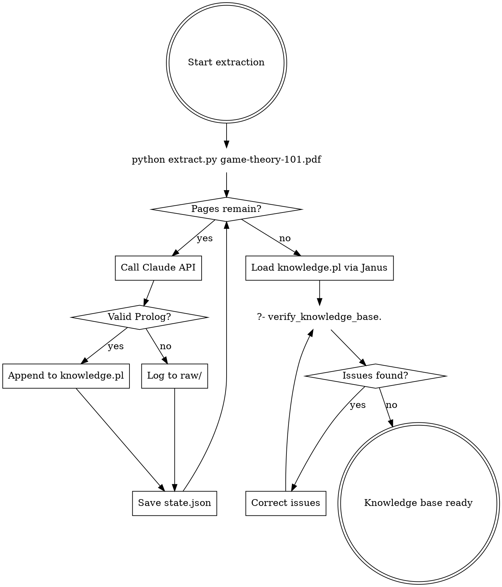

# Game Theory PDF Knowledge Extraction Design

**Date:** 2025-12-31
**Status:** Revised
**Input:** game-theory-101.pdf (377 pages, 3.4MB)
**Output:** Prolog knowledge base queryable via Janus

## Overview

This system extracts concepts, relationships, examples, and formulas from a game theory textbook into Prolog facts. It combines automated extraction with interactive Janus verification.

## Approach

**Phase 1: Automated Extraction**
- Extract each page via Claude API
- Validate and accumulate Prolog facts in `output/knowledge.pl`
- Track progress in `state.json` for resumability

**Phase 2: Janus Verification**
- Load knowledge base in Claude Code session
- Run verification queries via Janus (following safety checklist)
- Correct undefined references, duplicates, malformed facts
- Produce clean, queryable knowledge base

## Prolog Schema

```prolog
:- dynamic concept/3.
:- dynamic relates/3.
:- dynamic example/3.
:- dynamic formula/3.

%% concept(+Name:atom, +Page:integer, +Definition:string) is nondet
%% Core concept definition.
% concept(nash_equilibrium, 42, "A strategy profile where no player benefits from unilateral change").

%% relates(+Concept1:atom, +Concept2:atom, +RelationType:atom) is nondet
%% Relationship between concepts.
% relates(nash_equilibrium, best_response, requires).

%% Relation types (declared as facts for validation):
valid_relation_type(requires).    % A requires B
valid_relation_type(illustrates). % A exemplifies B
valid_relation_type(contrasts).   % A opposes B
valid_relation_type(extends).     % A generalizes B
valid_relation_type(contains).    % A includes B

%% example(+Concept:atom, +Page:integer, +Description:string) is nondet
%% Concrete example of a concept.
% example(prisoners_dilemma, 15, "Two suspects interrogated separately").

%% formula(+Concept:atom, +Page:integer, +Expression:string) is nondet
%% Mathematical notation. Note: PDF extraction may mangle LaTeX/Unicode.
% formula(mixed_strategy, 87, "p*U(A) + (1-p)*U(B)").
```

## Project Structure

```
game-theory-extractor/
├── extract.py          # Main extraction loop
├── prompts.py          # Claude prompt templates
├── validate.py         # Prolog syntax validation
├── state.json          # Progress tracker (current page, errors)
├── output/
│   ├── knowledge.pl    # Accumulated Prolog facts
│   └── raw/            # Raw Claude responses (for debugging)
├── verify.pl           # Verification queries
├── test_extract.py     # Unit tests for extraction
└── pyproject.toml      # Dependencies: pypdf, anthropic
```

## Extraction Script

```python
import json
import os
import time
from anthropic import APIError, RateLimitError

STATE_FILE = "state.json"

def load_state():
    """Load last successful page from state file. Returns 1 if no state."""
    if os.path.exists(STATE_FILE):
        with open(STATE_FILE) as f:
            return json.load(f).get("current_page", 1)
    return 1

def save_state(page_num: int):
    """Persist current page for crash recovery."""
    with open(STATE_FILE, "w") as f:
        json.dump({"current_page": page_num}, f)

def process_pdf(pdf_path: str, start_page: int = None):
    if start_page is None:
        start_page = load_state()
        if start_page > 1:
            print(f"Resuming from page {start_page}")
    reader = PdfReader(pdf_path)
    max_retries = 3

    for page_num in range(start_page - 1, len(reader.pages)):
        text = reader.pages[page_num].extract_text()

        if not text or len(text) < 50:  # Skip empty/image pages
            log_skip(page_num + 1)
            continue

        for attempt in range(max_retries):
            try:
                prolog_facts = call_claude(text, page_num + 1)

                if validate_prolog_syntax(prolog_facts):
                    append_to_knowledge_base(prolog_facts)
                    save_state(page_num + 1)
                else:
                    log_invalid_output(page_num + 1, prolog_facts)
                    save_raw_response(page_num + 1, prolog_facts)
                break

            except RateLimitError:
                wait_time = 2 ** attempt  # Exponential backoff
                time.sleep(wait_time)
            except APIError as e:
                log_error(page_num + 1, e)
                save_state(page_num)  # Resume from here
                if attempt == max_retries - 1:
                    raise

        time.sleep(0.5)  # Base rate limiting
```

## Claude Prompt Template

```python
EXTRACTION_PROMPT = """You are extracting game theory concepts into Prolog facts.

Page {page_num} text:
'''
{page_text}
'''

Extract concepts, relationships, examples, and formulas from this page.
Output ONLY valid Prolog facts using these predicates:

concept(name, {page_num}, "definition").
relates(concept1, concept2, relation_type).
example(concept, {page_num}, "description").
formula(concept, {page_num}, "expression").

Rules:
- Use snake_case for concept names (nash_equilibrium, not "Nash Equilibrium")
- relation_type must be one of: requires, illustrates, contrasts, extends, contains
- If the page has no extractable concepts, output: % No concepts on this page
- For strings containing double quotes, double them: "He said ""hello"""
- Each fact on its own line
- For formulas: preserve mathematical structure even if symbols appear garbled
- Mark uncertain or complex formulas with: % FORMULA_CHECK_NEEDED
- Use ASCII approximations for symbols: >= for ≥, sum() for Σ, E[] for expected value

Output facts only, no explanation."""
```

## Model Selection

- **Model:** claude-sonnet-4-20250514 (balances cost and extraction quality)
- **Alternative:** Haiku for cost savings (~$0.60), Opus for complex pages
- **Input per page:** ~1,500-3,000 tokens (varies by density)
- **Output per page:** ~200 tokens
- **Estimated cost:** $2.50-$5.00

## Verification Queries

```prolog
%% verify_knowledge_base is det
%% Entry point for Phase 2. Run all verification checks.
verify_knowledge_base :-
    format('~n=== Undefined Concepts ===~n'),
    forall(undefined_concept(C), format('  ~w~n', [C])),
    format('~n=== Orphan Concepts ===~n'),
    forall(orphan_concept(C), format('  ~w~n', [C])),
    format('~n=== Duplicate Concepts ===~n'),
    forall(duplicate_concept(C, Ps), format('  ~w: pages ~w~n', [C, Ps])),
    format('~n=== Invalid Relations ===~n'),
    forall(invalid_relation(C1, C2, R), format('  ~w -> ~w: ~w~n', [C1, C2, R])).

%% undefined_concept(-C) is nondet
%% C appears in relates/3 but lacks a concept/3 definition.
%% Uses distinct/2 to avoid duplicate results when C appears in both positions.
undefined_concept(C) :-
    distinct(C, (
        ( relates(C, _, _) ; relates(_, C, _) ),
        \+ concept(C, _, _)
    )).

%% orphan_concept(-C) is nondet
%% C has a definition but no relations. May be valid for foundational concepts.
orphan_concept(C) :-
    concept(C, _, _),
    \+ relates(C, _, _),
    \+ relates(_, C, _).

%% duplicate_concept(-C, -Pages) is nondet
%% C has definitions on multiple pages.
duplicate_concept(C, Pages) :-
    setof(P, D^concept(C, P, D), Pages),
    length(Pages, N),
    N > 1.

%% invalid_relation(-C1, -C2, -R) is nondet
%% R is not a valid relation type.
invalid_relation(C1, C2, R) :-
    relates(C1, C2, R),
    \+ valid_relation_type(R).
```

## Janus Safety Checklist

Before running verification queries in Phase 2:

- [ ] Use context manager for all `janus.query()` calls
- [ ] Wrap `py_call` in exception handlers
- [ ] Add `heartbeat()` in iteration loops (knowledge base may have 5000+ facts)
- [ ] Plan `py_free` for large result sets
- [ ] Parameterize any user input to queries

Example safe query pattern:
```python
from janus_swi import Query, consult, PrologError
import janus_swi as janus

def run_verification():
    try:
        consult("output/knowledge.pl")
        consult("verify.pl")
    except PrologError as e:
        print(f"Failed to load knowledge base: {e}")
        raise

    try:
        with Query("verify_knowledge_base") as q:
            for _ in q:
                janus.heartbeat()  # Prevent timeout on large knowledge bases
    except PrologError as e:
        print(f"Verification query failed: {e}")
        raise
```

## Workflow



## Handoffs

| Condition | Next Step | Entry Point |
|-----------|-----------|-------------|
| Extraction complete | Phase 2 verification | `load_kb` in workflow |
| Verification finds issues | Re-extract or manual fix | `fix_issues` in workflow |
| Clean knowledge base | User queries | `?- concept(X, _, _).` |
| Janus query fails | Check safety checklist | Janus Safety section |

## Deliverables

- `game-theory-extractor/` - Complete Python project
- `output/knowledge.pl` - Prolog knowledge base (~2,000-5,000 facts)
- `verify.pl` - Verification queries
- `test_extract.py` - Unit tests for extraction logic

## Next Steps

1. Create `game-theory-extractor/` project structure
2. Implement `extract.py` with exception handling and retry logic
3. Implement `validate.py` for Prolog syntax checking
4. Implement `prompts.py` with extraction template
5. Run extraction on full PDF
6. Verify with Janus queries (following safety checklist)
