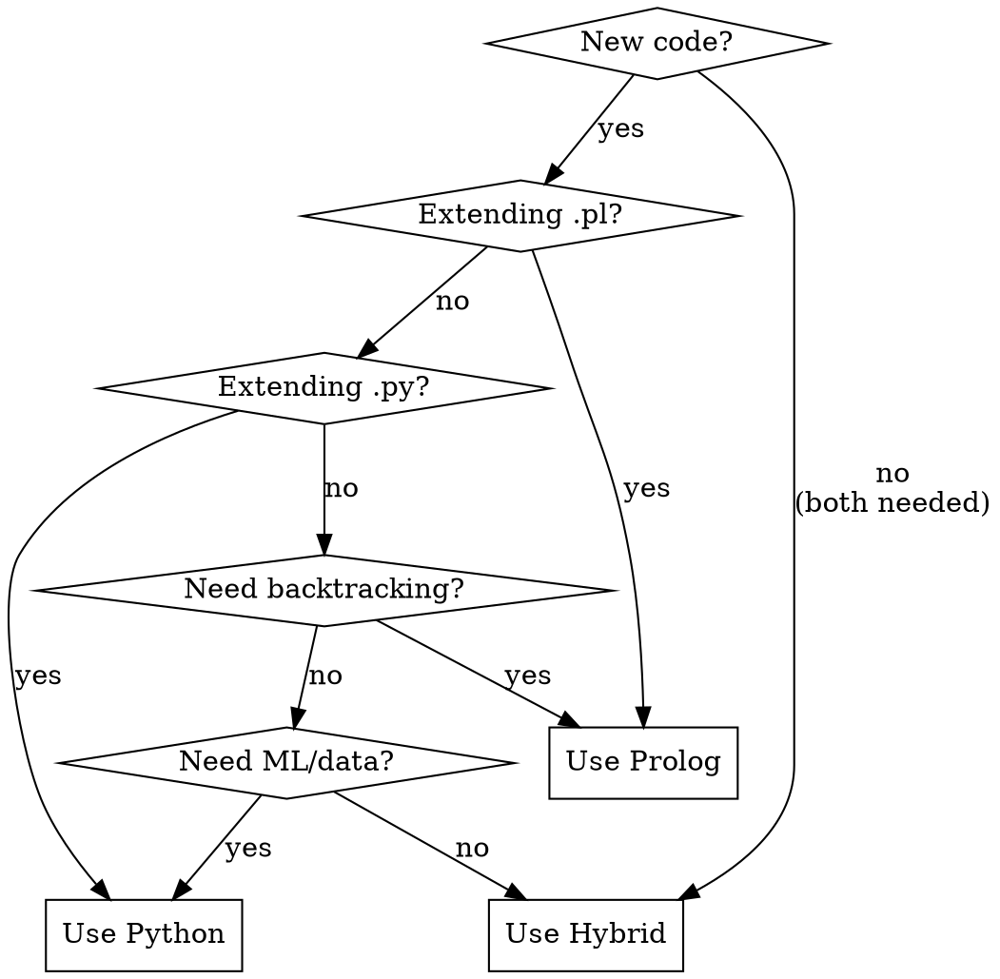
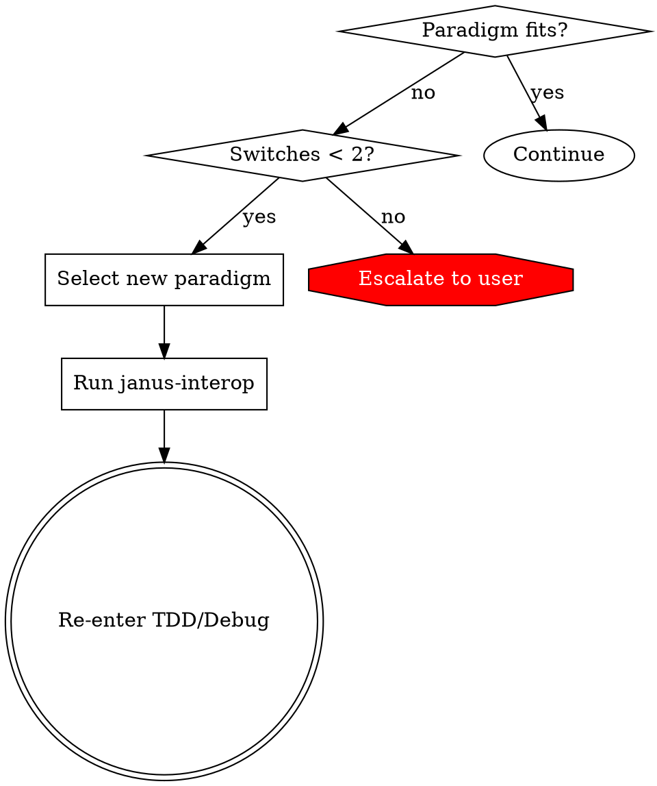

# Janus System Idiomatic Adherence Design

**Date:** 2025-12-31
**Status:** Approved (senior review incorporated)
**Revision:** 2

## Problem Statement

The superpowers repo contains three Janus skills (`janus-reasoning`, `janus-interop`, `janus-reverse-engineering`) but their wiring does not fully adhere to the canonical Janus workflow defined in `~/.claude/CLAUDE.dot`.

## Audit Findings

Two competitive code reviewers found **47 issues each** across four standards:

| Standard | Agent A | Agent B |
|----------|---------|---------|
| Janus System | 9 | 9 |
| GraphViz | 11 | 11 |
| Strunk | 16 | 15 |
| O'Keefe | 11 | 12 |

### Critical Issues (8 total, deduplicated)

1. `janus_re.pl:44-47` — Redundant `has_input/2` clause
2. `janus_re.pl:64-65` — Hash functions wrongly in `crypto_purpose/1`
3. `janus-interop:111-117` — Undefined `log_error/1` / procedural style
4. `janus-reverse-engineering:218-219` — Non-deterministic `incompatible/2`
5. `janus-reasoning:30-66` — Protocol uses ASCII instead of DOT
6. `janus-reverse-engineering:150-154` — NAF with dynamic predicates undocumented
7. `janus-reverse-engineering:176-190` — Overlapping `has_input` clauses
8. `test_janus_bridge.py:89-117` — No input validation for Role parameter

### Gap Analysis

| Dimension | Gap Count | Severity |
|-----------|-----------|----------|
| D. Test coverage | 2 skills | janus-reasoning and janus-interop untested |
| C. Bootstrap fidelity | 2 | Language selection missing, safety not routed |
| A. Skill completeness | 3 | No language selection guidance, incomplete paradigm switch |
| B. Cross-skill wiring | 4 edges | Handoffs implicit or missing |

## Design

### Priority Order: D → C → A → B (Tests First)

Per TDD principle and senior review feedback:
1. **D (Tests)** — Cannot verify changes without tests; write test specs first
2. **C (Bootstrap)** — Foundation; if Janus isn't enforced at entry, other improvements are optional
3. **A (Completeness)** — Can't wire what doesn't exist
4. **B (Wiring)** — Depends on A being complete

### Section 1: Test Coverage (D) — FIRST

**Problem:** `janus-reasoning` and `janus-interop` have no tests. Cannot verify other changes without coverage.

**Test structure to create:**

```
tests/janus-reasoning-test/
├── test_trigger_detection.py      # Test confusion trigger matching
└── test_protocol_completeness.py  # Verify all 6 prompts present

tests/janus-interop-test/
├── test_checklist_coverage.py     # Verify all 7 safety items present
└── test_safe_patterns.py          # Verify example code compiles

tests/test_skill_wiring.py         # Cross-skill handoff verification
```

**Exact test specifications:**

```python
# tests/janus-reasoning-test/test_trigger_detection.py
"""Test that janus-reasoning triggers are complete and match CLAUDE.md"""

REQUIRED_TRIGGERS = [
    "Test result doesn't match expectation",
    "Second failed fix attempt",
    "Can't decide between approaches",
    "Same error message twice in a row",
    "Output matches neither prediction nor its negation",
]

def test_all_triggers_documented():
    content = read_skill("janus-reasoning")
    for trigger in REQUIRED_TRIGGERS:
        assert trigger in content or similar_phrase(trigger, content)

# tests/janus-reasoning-test/test_protocol_completeness.py
"""Test that all 7 prompts are present (6 original + PARADIGM FIT)"""

REQUIRED_PROMPTS = [
    "EXPECTATION vs REALITY",
    "SEMANTIC",
    "SYMBOLIC",
    "COMPARE",
    "ONE HYPOTHESIS",
    "TRACK",
    "PARADIGM FIT",  # NEW - added per senior review
]

def test_all_prompts_present():
    content = read_skill("janus-reasoning")
    for prompt in REQUIRED_PROMPTS:
        assert prompt in content

# tests/janus-interop-test/test_checklist_coverage.py
"""Test that all 7 safety items from CLAUDE.dot are present"""

SAFETY_ITEMS = [
    "Close active queries",
    "Context manager",
    "py_object(true)",
    "py_free",
    "Parameterize input",
    "Catch exceptions",
    "heartbeat",
]

def test_all_safety_items_present():
    content = read_skill("janus-interop")
    for item in SAFETY_ITEMS:
        assert item.lower() in content.lower()

# tests/test_skill_wiring.py
"""Test cross-skill handoffs are documented"""

def test_janus_reasoning_references_interop():
    content = read_skill("janus-reasoning")
    assert "janus-interop" in content

def test_janus_re_references_reasoning():
    content = read_skill("janus-reverse-engineering")
    assert "janus-reasoning" in content

def test_janus_re_references_interop():
    content = read_skill("janus-reverse-engineering")
    assert "janus-interop" in content

def test_using_superpowers_routes_to_reasoning():
    content = read_skill("using-superpowers")
    assert "janus-reasoning" in content

def test_using_superpowers_routes_to_interop():
    content = read_skill("using-superpowers")
    assert "janus-interop" in content
```

### Section 2: Bootstrap Fidelity (C)

**Problem:** `using-superpowers` teaches skill invocation but doesn't enforce language selection or safety checklist.

**Exact content to add to `using-superpowers/SKILL.md`:**

Insert after "How You Reason" section, before "Self-Check":

```markdown
## Language Selection (Before Writing Code)

When starting implementation, select your paradigm:



**Why Prolog hosts in Hybrid mode:** Prolog's backtracking drives exploration; Python handles data transformation. This matches O'Keefe's guidance on leveraging Prolog's strengths.

After selection → invoke `janus-interop` BEFORE writing any interop code.
```

**Update skill routing table** (add these rows):

| Situation | Skill | Notes |
|-----------|-------|-------|
| **About to write** Prolog/Python interop | `janus-interop` | BEFORE writing, not during |
| Can't decide between Prolog/Python/Hybrid | `janus-reasoning` | Paradigm confusion trigger |
| Problem feels like paradigm mismatch | `janus-reasoning` | Paradigm confusion trigger |

### Section 3: Skill Completeness (A)

**Problem:** `janus-reasoning` lacks paradigm fit check and re-entry flow.

**Exact content to add to `janus-reasoning/SKILL.md`:**

Add prompt 7 after prompt 6 (TRACK) in the protocol box:

```
│ 7. PARADIGM FIT                                       │
│    "Current paradigm: ___"                            │
│    "Does reasoning fit this paradigm? [yes/no]"       │
│    "If no: Switch to ___ and re-enter at selection"   │
```

Add new section after "Exit Criteria":

```markdown
## Paradigm Switch

When prompt 7 answers "no" (paradigm doesn't fit):

1. **Select new paradigm** using language selection flow
2. **Re-run** `janus-interop` safety checklist
3. **Re-enter** at:
   - TDD: `run_green` (retry with new paradigm)
   - Debug: `trouble` (retry debug with new paradigm)

**Maximum switches:** 2. After 2nd switch with no progress → escalate to user.


```

### Section 4: Cross-Skill Wiring (B)

**Problem:** Skills mention each other but handoffs are implicit.

**Exact content to add to `using-superpowers/SKILL.md`** (new section after Skill Routing):

```markdown
## Skill Handoffs

| From | To | Trigger | Entry Point |
|------|-----|---------|-------------|
| Any | `janus-reasoning` | Confusion triggers (5) | Protocol prompt 1 |
| `janus-reasoning` | `janus-interop` | After paradigm selection | Pre-Execution Checklist |
| `janus-reasoning` | TDD | Exit criteria met | `run_green` |
| `janus-reasoning` | Debug | Exit criteria met | `trouble` |
| `janus-reverse-engineering` | `janus-interop` | Before ANY Prolog query | Pre-Execution Checklist |
| `janus-reverse-engineering` | `janus-reasoning` | Unresolvable contradiction | Protocol prompt 1 |
```

**Add Handoffs section to each Janus skill:**

For `janus-reasoning/SKILL.md`:
```markdown
## Handoffs

| Condition | Next | Entry Point |
|-----------|------|-------------|
| Paradigm selected, needs interop | `janus-interop` | Pre-Execution Checklist |
| Exit criteria met (from TDD) | TDD | `run_green` |
| Exit criteria met (from Debug) | Debug | `trouble` |
| Max attempts reached | User | Ask for help |
```

For `janus-interop/SKILL.md`:
```markdown
## Handoffs

| Condition | Next | Entry Point |
|-----------|------|-------------|
| Checklist complete | Caller | Resume at code writing |
| Violation found | Caller | Fix before proceeding |
```

For `janus-reverse-engineering/SKILL.md`:
```markdown
## Handoffs

| Condition | Next | Entry Point |
|-----------|------|-------------|
| About to write Prolog query | `janus-interop` | Pre-Execution Checklist |
| Unresolvable contradiction | `janus-reasoning` | Protocol prompt 1 |
| Claim validated | User | Present findings |
```

### Critical Bug Fixes

These must be fixed regardless of design (can be done in parallel with D):

1. **Remove redundant clause** in `janus_re.pl:44-47`
2. **Remove hash functions from `crypto_purpose/1`** in `janus_re.pl:64-65` — hash functions do NOT require keys
3. **Fix `log_error/1`** in janus-interop examples — use `print_message(error, Error)`
4. **Make `incompatible/2` deterministic** — wrap in `once/1`
5. **Add input validation** in `test_janus_bridge.py` for Role parameter
6. **Convert ASCII protocol box to DOT** in janus-reasoning

## Implementation Plan

1. **Create test infrastructure** (D) — Write failing tests first
2. **Fix critical bugs** — Standalone commits, tests should catch regressions
3. **Update `using-superpowers`** (C) — Language selection + routing
4. **Update `janus-reasoning`** (A) — Paradigm fit + re-entry
5. **Add Handoffs sections** (B) — All three Janus skills
6. **Update `superpowers/CLAUDE.md`** — Skill dependency diagram
7. **Run all tests** — Verify changes

## Risk Matrix

| Risk | Likelihood | Impact | Mitigation |
|------|------------|--------|------------|
| Circular handoff dependencies | Medium | High | Test chains explicitly; add cycle detection |
| Language selection too complex | Medium | Medium | Use DOT graph; keep under 7 nodes |
| Safety checklist bypassed | High | High | Add pre-commit hook or CI check |
| Paradigm switch infinite loop | Low | High | Enforce max 2 switches with escalation |
| Tests added after changes | N/A | N/A | **Mitigated**: D-first sequence enforced |

## Open Questions (Resolved)

| Question | Resolution |
|----------|------------|
| Tests first or last? | **First** (TDD principle, senior review) |
| Language selection: separate skill or inline? | **Inline** in using-superpowers (reduces indirection) |
| ASCII to DOT conversion? | **Yes** for janus-reasoning protocol (consistency) |
| 2-paradigm-switch limit? | **Keep as-is** with escalation to user |

## Appendix: Review Summary

### Agent A (47 issues)
- 4 Critical, 14 Major, 29 Minor
- Key finding: Hash functions in `crypto_purpose/1` is semantic error

### Agent B (47 issues)
- 6 Critical, 18 Major, 23 Minor
- Key finding: NAF with dynamic predicates undocumented
- **Winner on severity count**

### Senior Reviewer
- Verdict: **APPROVE WITH CHANGES**
- Critical feedback incorporated:
  - Sequence changed to D→C→A→B
  - Exact content specified
  - Missing triggers added
  - Safety checklist timing fixed
  - Paradigm fit check added
