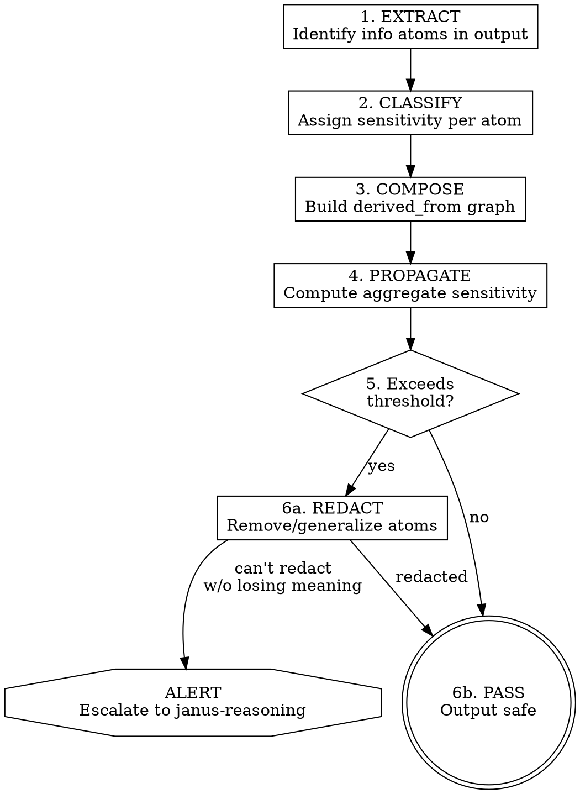
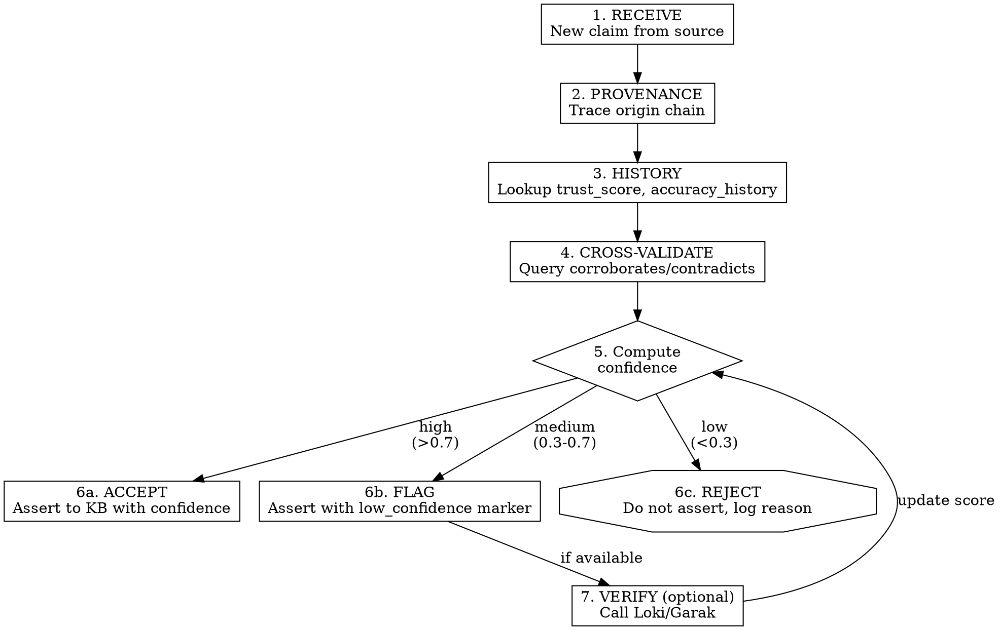
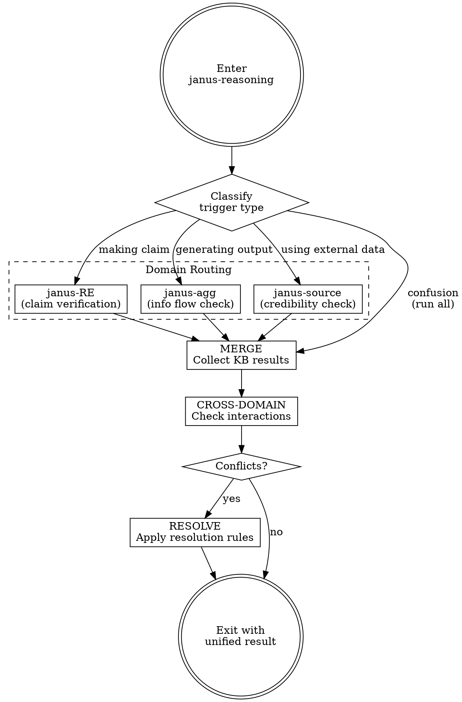

# BENGAL Coverage Extension Design

Extending superpowers to cover all four IARPA BENGAL domains through hybrid integration of existing tools and new Janus skills.

## Background

IARPA's BENGAL (Bias Effects and Notable Generative AI Limitations) program targets four domains:

| Domain | Focus | Current Coverage |
|--------|-------|------------------|
| D1: Biases & Diverse Perspectives | Detect biases, induce diverse viewpoints | None |
| D2: Hallucinations & Inferences | Detect/mitigate false outputs | `janus-reverse-engineering` |
| D3: Safe Information Flow | Prevent aggregation attacks, unlearning | None |
| D4: Poisoned Source Resilience | Source credibility, cross-validation | None |

## Solution Overview

Hybrid approach: use existing tools where mature, extend Janus for gaps.

```
              +---------------------+
              |   janus-reasoning   | <- orchestrator
              |  (entry + routing)  |
              +---------+-----------+
                        | delegates
        +---------------+---------------+
        v               v               v
  +-----------+   +-----------+   +-----------+
  | janus-RE  |   | janus-agg |   |janus-source|
  |(halluci.) |   |(info flow)|   |(credibility)|
  +-----+-----+   +-----+-----+   +-----+-----+
        |               |               |
        v               v               v
  +---------------------------------------------+
  |              Shared Prolog KB               |
  |  +--------+ +--------+ +--------+ +------+  |
  |  |RE facts| |Agg facts| |Src facts| |Rules | |
  |  +--------+ +--------+ +--------+ +------+  |
  +---------------------------------------------+
        ^               ^               ^
  +-----------+   +-----------+   +-----------+
  |   Loki    |   |    ART    |   |   Garak   |
  |  (verify) |   | (defend)  |   |  (scan)   |
  +-----------+   +-----------+   +-----------+
```

### Domain Coverage Mapping

| Domain | Tool/Skill | Role |
|--------|------------|------|
| D1: Diverse Perspectives | OpenEvolve (external) | Evolutionary multi-perspective generation |
| D2: Hallucinations | `janus-reverse-engineering` (exists) | Prolog consistency checking |
| D3: Safe Information Flow | ART + **new: `janus-aggregation`** | Constraint propagation for aggregation detection |
| D4: Poisoned Sources | Loki + Garak + **new: `janus-source`** | Credibility reasoning |

## Skill Inventory

### Existing Skills (Enhanced)

| Skill | Current | Enhancement |
|-------|---------|-------------|
| `janus-reasoning` | Confusion escape hatch | Add orchestration: route to domain skills, merge KB results |
| `janus-interop` | Safety checklist | Add shared KB lifecycle management |
| `janus-reverse-engineering` | Hallucination detection | Assert to shared KB, check source credibility before claims |

### New Skills

| Skill | Purpose | External Tools |
|-------|---------|----------------|
| `janus-aggregation` | Detect info flow violations via constraint propagation | ART (optional) |
| `janus-source` | Credibility reasoning: provenance, cross-validation, trust | Loki, Garak |

### Tool Wrapper Skills

| Skill | Wraps | Purpose |
|-------|-------|---------|
| `tool-loki` | OpenFactVerification | Fact verification |
| `tool-garak` | Garak | LLM vulnerability scanning |
| `tool-openevolve` | OpenEvolve | Diverse perspective generation |

## Shared Prolog KB Schema

```prolog
%% === DOMAIN 2: Hallucination Detection (existing janus-RE) ===
% Code analysis facts
function(Name, Address, Arity).
calls(Caller, Callee).
param_type(Func, ParamIdx, Type).
returns(Func, Type).
hypothesis(Id, Domain, Claim, Confidence).
contradiction(Hyp1, Hyp2, Reason).

%% === DOMAIN 3: Aggregation Detection (new janus-agg) ===
% Information atoms
info_atom(Id, Content, Sensitivity).          % individual fact
derived_from(AtomId, SourceAtoms).            % composition chain
sensitivity_rule(Pattern, Level).             % e.g., [ip, auth, rate_limit] -> critical

% Aggregation constraints
max_aggregate_sensitivity(Context, Level).    % threshold per context
violates(AtomSet, Rule, Reason).              % constraint violation

%% === DOMAIN 4: Source Credibility (new janus-source) ===
% Provenance
source(DataId, Origin, Timestamp, Method).
transformed_by(DataId, Agent, Transform, Timestamp).
provenance_chain(DataId, Chain).              % derived: full lineage

% Cross-validation
claims(SourceId, FactId, Confidence).
corroborates(Source1, Source2, FactId).
contradicts_source(Source1, Source2, FactId, Reason).

% Trust scoring
trust_score(SourceId, Domain, Score).         % 0.0-1.0
accuracy_history(SourceId, Correct, Total).
known_bias(SourceId, Direction, Domain).
authority(SourceId, Domain, Level).           % none/low/medium/high/authoritative

%% === CROSS-DOMAIN RULES ===
% RE claims trigger source checks
requires_verification(Hyp) :-
    hypothesis(Hyp, security, _, _).

% Aggregation alerts trigger reasoning
escalate_to_reasoning(Reason) :-
    violates(_, _, Reason),
    \+ resolved(Reason).

% Low-trust sources weaken RE hypotheses
weakened(Hyp, Reason) :-
    hypothesis(Hyp, _, _, _),
    derived_from_source(Hyp, Src),
    trust_score(Src, _, Score),
    Score < 0.5,
    Reason = low_trust_source(Src, Score).
```

## janus-aggregation Skill

### Purpose

Detect when innocuous facts combine into sensitive intel via constraint propagation.

### Contexts (MVP: code analysis first)

1. **Code analysis** - Comments/docs revealing attack surface
2. **Conversation** - Multi-turn probing for aggregatable intel
3. **Document generation** - Reports synthesizing classified sources

### Pattern



### Sensitivity Composition Rules

| Atoms Combined | Individual Level | Aggregate Level | Rationale |
|----------------|------------------|-----------------|-----------|
| internal_ip | low | low | Single fact, limited use |
| internal_ip + service_port | low + low | medium | Enables scanning |
| internal_ip + service_port + auth_method | low + low + low | high | Attack surface |
| internal_ip + service_port + auth_method + rate_limit | low x 4 | critical | Full exploit path |

### Code Analysis Extractors

```python
EXTRACTORS = {
    'ip_address': r'\b(?:10|172\.(?:1[6-9]|2\d|3[01])|192\.168)\.\d+\.\d+\b',
    'auth_reference': r'(?:token|key|secret|password|credential|auth)',
    'endpoint_path': r'(?:\/api\/|\/internal\/|\/admin\/)',
    'rate_limit': r'(?:rate.?limit|throttle|max.?requests?)\s*[:=]\s*\d+',
    'timeout': r'(?:timeout|ttl|expire)\s*[:=]\s*\d+',
    'internal_hostname': r'\b(?:internal|priv|corp|staging)\.[a-z]+\.[a-z]+\b',
}
```

## janus-source Skill

### Purpose

Reason about source credibility via provenance, cross-validation, and trust scoring.

### Trigger Conditions

- Before asserting facts from external sources to KB
- When janus-RE makes claims based on decompiled/third-party code
- When Loki/Garak return verification results
- When synthesizing information from multiple sources

### Pattern



### Confidence Computation

```prolog
%% Compute confidence for a claim
claim_confidence(Claim, Source, Confidence) :-
    base_trust(Source, BaseTrust),
    provenance_factor(Claim, ProvFactor),
    corroboration_factor(Claim, CorrFactor),
    contradiction_penalty(Claim, ContraPenalty),
    Confidence is min(1.0, BaseTrust * ProvFactor * CorrFactor - ContraPenalty).

%% Base trust from history
base_trust(Source, Trust) :-
    accuracy_history(Source, Correct, Total),
    Total > 10,
    Trust is Correct / Total.
base_trust(Source, 0.5) :-  % default for unknown sources
    \+ accuracy_history(Source, _, _).

%% Provenance: shorter chains = higher trust
provenance_factor(Claim, Factor) :-
    provenance_chain(Claim, Chain),
    length(Chain, Len),
    Factor is 1.0 / (1 + 0.1 * Len).  % decay per hop

%% Corroboration: independent sources boost confidence
corroboration_factor(Claim, Factor) :-
    findall(S, (corroborates(S, _, Claim), independent(S)), Sources),
    length(Sources, N),
    Factor is 1.0 + (0.1 * N).  % +10% per corroborating source

%% Contradictions: penalty for conflicts
contradiction_penalty(Claim, Penalty) :-
    findall(C, contradicts_source(_, _, Claim, C), Conflicts),
    length(Conflicts, N),
    Penalty is 0.2 * N.  % -20% per contradiction
```

## Enhanced janus-reasoning (Orchestrator)

### Updated Role

- **Current:** Confusion escape hatch with bidirectional reasoning protocol
- **Enhanced:** Central orchestrator that routes to domain skills and merges KB results

### Orchestration Flow



### Trigger Classification

| Trigger Signal | Route To | Rationale |
|----------------|----------|-----------|
| "About to claim X is vulnerable" | janus-RE | Hallucination risk |
| "Generating code/docs/report" | janus-agg | Aggregation risk |
| "Using data from source Y" | janus-source | Credibility check |
| "Test failed unexpectedly" | All three | Unknown cause, full analysis |
| "Same error twice" | All three | Confusion state |

### Cross-Domain Interaction Rules

```prolog
%% RE claim requires source check first
blocked(assert_hypothesis(H)) :-
    hypothesis_source(H, Src),
    \+ verified_source(Src),
    log(blocking, H, unverified_source).

%% Aggregation alert weakens related RE claims
weakened_by_aggregation(Hyp) :-
    hypothesis(Hyp, _, Claim, _),
    mentions_atom(Claim, Atom),
    violates(AtomSet, _, _),
    member(Atom, AtomSet).

%% Low-credibility source blocks aggregation pass
blocked(pass_aggregation(Output)) :-
    derived_from_source(Output, Src),
    trust_score(Src, _, Score),
    Score < 0.3,
    log(blocking, Output, untrusted_source(Src)).
```

### Updated Protocol Prompts

```
1. EXPECTATION vs REALITY
   [ ] I expected: ___
   [ ] I observed: ___

2. SEMANTIC (patterns)
   [ ] This reminds me of: ___

3. SYMBOLIC (logic)
   [ ] What must be true: ___

4. DOMAIN CHECK                              <-- NEW
   [ ] Am I making a claim? -> route to janus-RE
   [ ] Am I generating output? -> route to janus-agg
   [ ] Am I using external data? -> route to janus-source
   [ ] Unsure -> run all, merge results

5. KB STATE                                  <-- NEW
   [ ] Contradictions in KB: ___
   [ ] Low-confidence facts: ___
   [ ] Aggregation violations: ___

6. ONE HYPOTHESIS (unchanged)

7. PARADIGM FIT (unchanged)
```

## Tool Wrapper Skills

### tool-loki (Fact Verification)

```python
def verify_claim(claim: str, context: str = None) -> VerificationResult:
    """
    Returns:
        verified: bool
        confidence: float (0.0-1.0)
        evidence: list[str]
        reasoning: str
    """
    cmd = ["uvx", "openfactverification", "--claim", claim]
    if context:
        cmd.extend(["--context", context])

    result = subprocess.run(cmd, capture_output=True, text=True)
    return parse_loki_output(result.stdout)

def assert_verified(claim: str, result: VerificationResult):
    """Assert verification result to shared KB"""
    janus.query(f"""
        assertz(verified_claim('{claim}', {result.confidence})),
        assertz(verification_evidence('{claim}', {result.evidence}))
    """)
```

### tool-garak (Vulnerability Scanning)

```python
def scan_model(model_id: str, probes: list[str] = None) -> ScanResult:
    """
    Returns:
        vulnerabilities: list[Vulnerability]
        trust_impact: float
        report_path: str
    """
    cmd = ["uvx", "garak", "--model_type", "huggingface",
           "--model_name", model_id,
           "--probes", ",".join(probes or ["all"])]

    result = subprocess.run(cmd, capture_output=True, text=True)
    return parse_garak_output(result.stdout)

def update_trust_from_scan(source_id: str, result: ScanResult):
    """Adjust trust score based on vulnerabilities found"""
    penalty = len(result.vulnerabilities) * 0.05
    janus.query(f"""
        retract(trust_score('{source_id}', _, OldScore)),
        NewScore is max(0, OldScore - {penalty}),
        assertz(trust_score('{source_id}', general, NewScore)),
        assertz(garak_scan('{source_id}', {result.vulnerabilities}))
    """)
```

### tool-openevolve (Diverse Perspectives)

```python
def evolve_perspectives(problem: str, num_islands: int = 5) -> list[Perspective]:
    """
    Returns:
        perspectives: list[Perspective]
            - approach: str
            - reasoning: str
            - trade_offs: list[str]
            - fitness_score: float
    """
    config = {
        "problem": problem,
        "num_islands": num_islands,
        "migration_interval": 10,
        "diversity_weight": 0.7,
    }

    result = openevolve.run(config)
    return result.pareto_front

def assert_perspectives(problem_id: str, perspectives: list[Perspective]):
    """Record diverse perspectives for bias mitigation"""
    for i, p in enumerate(perspectives):
        janus.query(f"""
            assertz(perspective('{problem_id}', {i}, '{p.approach}')),
            assertz(perspective_reasoning('{problem_id}', {i}, '{p.reasoning}')),
            assertz(perspective_fitness('{problem_id}', {i}, {p.fitness_score}))
        """)
```

### Installation

```bash
uv add openfactverification garak openevolve
```

Or for one-off execution:

```bash
uvx openfactverification --claim "..."
uvx garak --model_type huggingface --model_name "..."
uvx openevolve run --config config.yaml
```

## Testing Strategy

### Test Structure

```
tests/
├── janus-aggregation-test/
│   ├── pyproject.toml
│   ├── test_extractors.py
│   ├── test_sensitivity.py
│   ├── test_propagation.py
│   ├── test_redaction.py
│   └── samples/
│       ├── leaky_comments.py
│       └── safe_comments.py
│
├── janus-source-test/
│   ├── pyproject.toml
│   ├── test_provenance.py
│   ├── test_crossval.py
│   ├── test_trust.py
│   ├── test_loki_integration.py
│   └── test_garak_integration.py
│
└── janus-orchestration-test/
    ├── pyproject.toml
    ├── test_routing.py
    ├── test_merge.py
    ├── test_cross_domain.py
    └── test_end_to_end.py
```

### Key Test Cases

| Skill | Test Case | Expected Outcome |
|-------|-----------|------------------|
| janus-agg | 4 low-sensitivity atoms combined | Escalate to critical |
| janus-agg | Single internal IP in comment | Pass (low risk) |
| janus-agg | Redaction preserves meaning | Output still useful |
| janus-source | Unknown source, no history | Default 0.5 trust |
| janus-source | 3 independent corroborations | Trust boost +30% |
| janus-source | Contradiction from authoritative source | Trust penalty, flag |
| orchestrator | RE claim from unverified source | Block until verified |
| orchestrator | Confusion trigger | Route to all three |

### Run Commands

```bash
# Fast unit tests
cd tests/janus-aggregation-test && uv run pytest -v

# Integration tests (requires tools installed)
cd tests/janus-source-test && uv run pytest -v -m integration

# Full orchestration test
cd tests/janus-orchestration-test && uv run pytest -v test_end_to_end.py
```

## Implementation Order

### Phase 1: Foundation (shared KB infrastructure)

| Step | Deliverable | Dependencies |
|------|-------------|--------------|
| 1.1 | Shared KB module (`lib/janus-kb.py`) | None |
| 1.2 | KB lifecycle in `janus-interop` | 1.1 |
| 1.3 | Unit tests for KB operations | 1.1 |

### Phase 2: janus-aggregation (Domain 3)

| Step | Deliverable | Dependencies |
|------|-------------|--------------|
| 2.1 | Info atom extractors (code context) | 1.1 |
| 2.2 | Sensitivity classification rules | 2.1 |
| 2.3 | Constraint propagation engine | 2.2 |
| 2.4 | Redaction strategies | 2.3 |
| 2.5 | `janus-aggregation` skill SKILL.md | 2.4 |
| 2.6 | Unit + integration tests | 2.5 |

### Phase 3: janus-source (Domain 4)

| Step | Deliverable | Dependencies |
|------|-------------|--------------|
| 3.1 | Provenance chain tracking | 1.1 |
| 3.2 | Cross-validation rules | 3.1 |
| 3.3 | Trust score computation | 3.2 |
| 3.4 | `tool-loki` wrapper | None (parallel) |
| 3.5 | `tool-garak` wrapper | None (parallel) |
| 3.6 | `janus-source` skill SKILL.md | 3.3, 3.4, 3.5 |
| 3.7 | Unit + integration tests | 3.6 |

### Phase 4: Orchestration enhancement

| Step | Deliverable | Dependencies |
|------|-------------|--------------|
| 4.1 | Trigger classification logic | 2.5, 3.6 |
| 4.2 | Cross-domain interaction rules | 4.1 |
| 4.3 | Update `janus-reasoning` SKILL.md | 4.2 |
| 4.4 | End-to-end tests | 4.3 |

### Phase 5: Domain 1 integration

| Step | Deliverable | Dependencies |
|------|-------------|--------------|
| 5.1 | `tool-openevolve` wrapper | None |
| 5.2 | Perspective KB integration | 5.1, 1.1 |
| 5.3 | Bias detection rules | 5.2 |
| 5.4 | Integration tests | 5.3 |

### Phase 6: Documentation + polish

| Step | Deliverable | Dependencies |
|------|-------------|--------------|
| 6.1 | Update CLAUDE.md with BENGAL coverage | All |
| 6.2 | Architecture diagram (DOT) | All |
| 6.3 | Example workflows | All |

### Dependency Graph

```
Phase 1 --------------------------------------+
    |                                         |
    +---> Phase 2 (janus-agg) ---------------+|
    |                                        ||
    +---> Phase 3 (janus-source) ------------++--> Phase 4 (orchestration)
    |         |                              ||           |
    |         +-- tool-loki -----------------+|           |
    |         +-- tool-garak -----------------+           |
    |                                                     |
    +---> Phase 5 (openevolve) ---------------------------+--> Phase 6 (docs)
```

## References

- [IARPA BENGAL Program](https://www.iarpa.gov/research-programs/bengal)
- [OpenFactVerification (Loki)](https://github.com/Libr-AI/OpenFactVerification)
- [Garak LLM Vulnerability Scanner](https://github.com/leondz/garak)
- [OpenEvolve](https://github.com/algorithmicsuperintelligence/openevolve)
- [Adversarial Robustness Toolbox](https://github.com/Trusted-AI/adversarial-robustness-toolbox)
