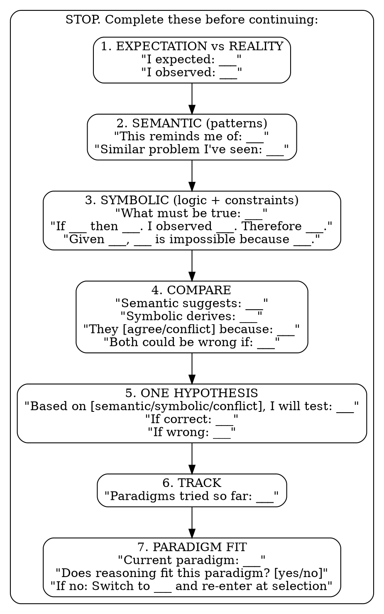
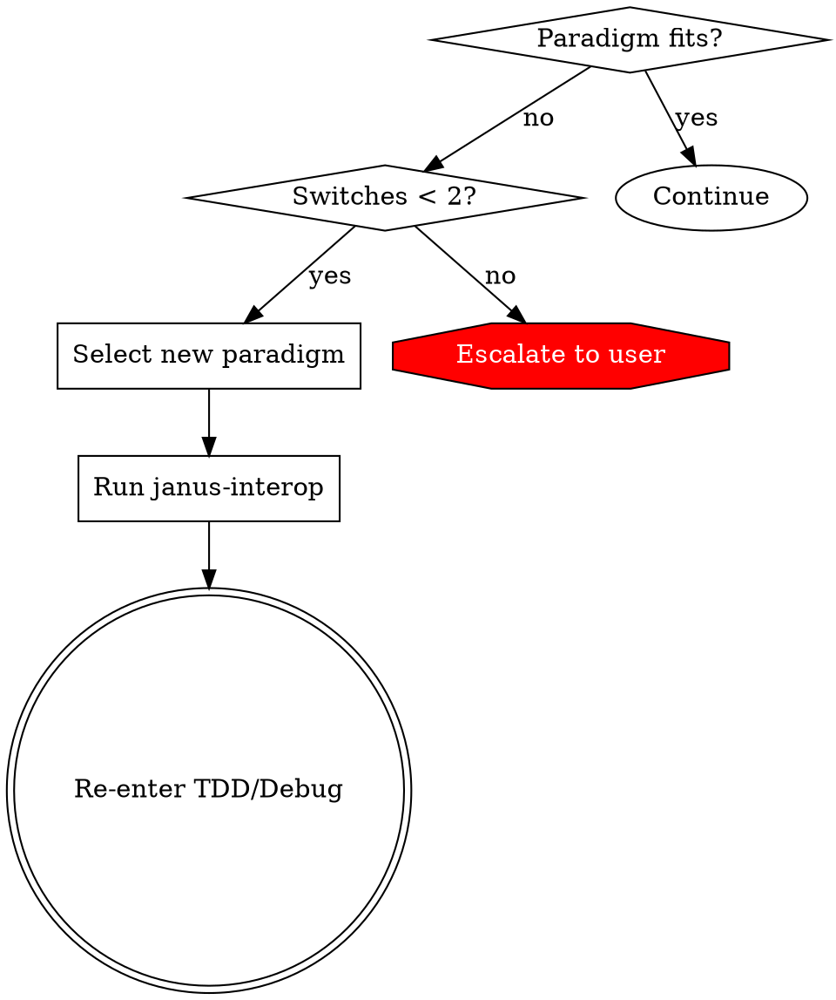

# Janus Reasoning

## Overview

When confused, stop guessing. Derive your next action from evidence and logic.

**Core principle:** Hypotheses must be DERIVED from reasoning, not GUESSED from intuition.

## When to Use

**Triggers (any one forces entry):**

| Trigger | Type |
|---------|------|
| Test result doesn't match expectation | Self-assessed |
| Second failed fix attempt | Self-assessed |
| Can't decide between approaches | Self-assessed |
| Same error message twice in a row | Objective |
| Output matches neither prediction nor its negation | Objective |

**You are here because:** TDD or debugging routed you here, or you recognized confusion.

## The Protocol

Complete ALL prompts before your next attempt. Write the answers, don't just think them.



## Exit Criteria

**EXIT when ALL of:**
- [ ] Semantic and symbolic agree (or conflict is explained)
- [ ] Hypothesis cites evidence from prompt 2, 3, or 4
- [ ] Hypothesis has testable predictions (both correct and wrong cases)

**ESCALATE when:**
- [ ] Paradigm switched twice with no progress

After exit: make ONE change, test, return here if still confused.

## Paradigm Switch

When prompt 7 answers "no" (paradigm doesn't fit):

1. **Select new paradigm** using language selection flow
2. **Re-run** `janus-interop` safety checklist
3. **Re-enter** at:
   - TDD: `run_green` (retry with new paradigm)
   - Debug: `trouble` (retry debug with new paradigm)

**Maximum switches:** 2. After 2nd switch with no progress → escalate to user.



## Hypothesis Quality Gate

Before applying your fix, verify your hypothesis is DERIVED:

**DERIVED (acceptable):**
```
"Based on symbolic derivation: the lock must be held during read.
 I see stale data. Therefore lock is not held.
 I will add lock acquisition before read."
```

**GUESSED (not acceptable):**
```
"Maybe it's a race condition. I'll add a lock."
```

The difference: derived hypotheses cite evidence from prompt 2, 3, or 4. Guesses do not.

If you cannot point to which prompt your hypothesis came from, you have not completed symbolic reasoning. Return to prompt 3.

## Worked Example

**Scenario:** Test expects `parse_query("user:alice")` to return `{type: "user", name: "alice"}` but returns `undefined`.

```
1. EXPECTATION vs REALITY
   I expected: {type: "user", name: "alice"}
   I observed: undefined

2. SEMANTIC (patterns)
   This reminds me of: Parser returning undefined when regex doesn't match
   Similar problem I've seen: Missing case in pattern match, input format
   assumption wrong

3. SYMBOLIC (logic + constraints)
   What must be true: Input must match the expected format for any branch
   to execute. The "user:" prefix exists. The colon splits correctly.

   If the regex matches, then result is defined. Result is undefined.
   Therefore regex did not match.

   Given the input contains "user:alice", empty result is impossible
   unless the regex expects different format (e.g., "user=alice" not
   "user:alice").

4. COMPARE
   Semantic suggests: Missing case or wrong assumption about input format
   Symbolic derives: Regex did not match, likely format mismatch
   They agree: Both point to format/pattern mismatch
   Both could be wrong if: The function throws before regex runs

5. ONE HYPOTHESIS
   Based on symbolic derivation (regex format mismatch), I will test:
   Read the regex pattern in parse_query and compare to input format.

   If correct: Regex uses "=" or different delimiter, not ":"
   If wrong: Regex uses ":" and something else prevents match

6. TRACK
   Paradigms tried so far: Python (regex analysis)
```

**Outcome:** Hypothesis tested. Regex was `/(\w+)=(\w+)/` not `/(\w+):(\w+)/`. Fixed. Test passes.

## Two Lenses

You reason in two modes that inform each other:

| Semantic | Symbolic |
|----------|----------|
| "This reminds me of..." | "If X then Y. I observe Y. Therefore X." |
| Pattern recognition | Logical derivation |
| What does this look like? | What must be true? |

When they agree: high confidence.
When they conflict: investigate the mismatch before proceeding.

## Self-Check

If you notice yourself:
- Trying variations without stating what must be true
- Pattern-matching without deriving constraints
- Making multiple changes per attempt
- Saying "maybe" or "let me try" without evidence

**STOP.** You are in semantic-only mode. Complete prompts 3-5 before continuing.

## Red Flags

| Thought | Reality |
|---------|---------|
| "Let me just try one thing" | That's guessing. Complete the protocol. |
| "I think I see the pattern" | Write it in prompt 2. Then derive in prompt 3. |
| "This should work" | "Should" without derivation is a guess. |
| "It's probably X" | Prove it with logic in prompt 3. |

## Handoffs

| Condition | Next | Entry Point |
|-----------|------|-------------|
| Paradigm selected, needs interop | `janus-interop` | Pre-Execution Checklist |
| Exit criteria met (from TDD) | TDD | `run_green` |
| Exit criteria met (from Debug) | Debug | `trouble` |
| Max attempts reached | User | Ask for help |
