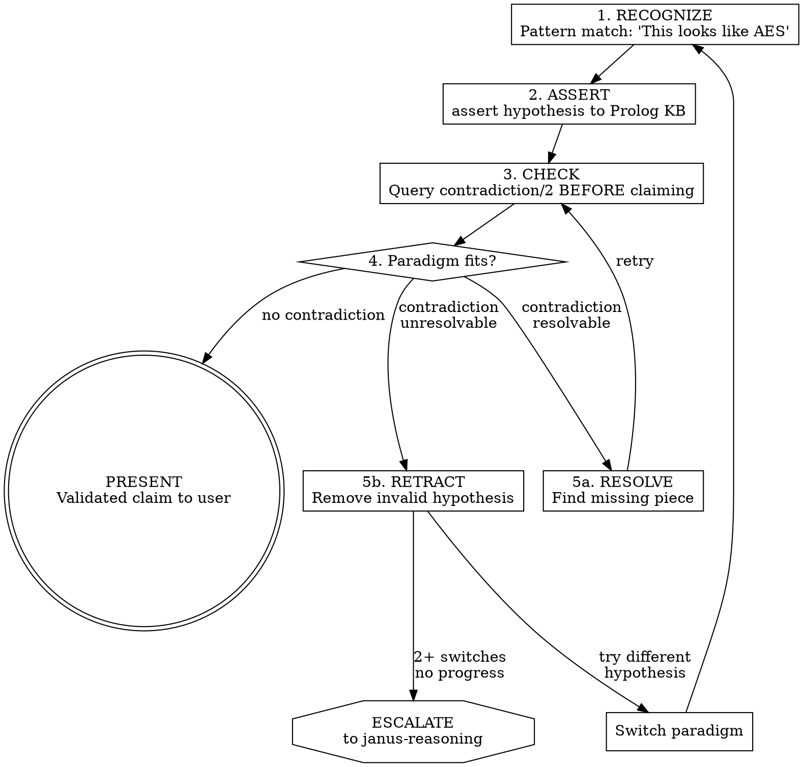

# Janus Reverse Engineering

## Why This Exists

I have specific limitations during RE:

| My Limitation | What Goes Wrong |
|---------------|-----------------|
| State tracking across functions | Lose track of register/variable contents after ~10 functions |
| Constraint propagation | Say "X is a pointer" then treat it as int |
| Logical consistency | Pattern-match "looks like crypto" but miss contradictions |
| Hallucination | Claim vulnerabilities that don't exist (NDSS: 231% time wasted) |

**Solution:** Use Prolog as a consistency checker. Assert facts as I discover them. Query before making claims. Catch contradictions before presenting to user.

## When to Use

**Triggers:**
- Analyzing decompiled/disassembled code
- Tracing data flow across multiple functions
- Making claims about function purpose, types, or security properties
- About to tell user "this is vulnerable" or "this does X"

## The Pattern



## Semantic Parameter Inference

Ghidra produces generic parameter names (`param_1`, `*param_2`) that lack semantic meaning. Before asserting facts, infer roles from usage patterns:

### Usage Pattern Detection

| Pattern | Code Shape | Inferred Role |
|---------|------------|---------------|
| Counter | `*p = *p + 1` or `(*p)++` | `counter` |
| Buffer | `base + idx * stride` | `buffer` |
| Struct access | `param[N]` (small N) | `struct_access` |
| Unknown | No pattern matches | `unknown` |

**Detection logic (apply to each parameter):**

```
For each param in function signature:
  1. Check for counter pattern: *param incremented
  2. Check for buffer pattern: param used as base in pointer arithmetic
  3. Check for struct pattern: param[digit] access
  4. Default to "unknown" if no pattern matches
```

### Flexible Role Matching

Structural roles satisfy semantic requirements through Prolog rules:

| Structural Role | Hypothesis Context | Satisfies |
|-----------------|-------------------|-----------|
| `buffer` | any | `buffer` |
| `struct_access` | `network_io` | `socket` |
| `struct_access` | crypto purposes | `key` |
| 2+ `unknown` params | hash purposes | `input` AND `output` (both) |

This allows validation even with Ghidra's generic naming.

## Knowledge Base Schema

### Facts I Assert

```prolog
% Declare dynamic predicates
:- dynamic function/3.
:- dynamic calls/3.
:- dynamic returns/2.
:- dynamic reads/3.
:- dynamic writes/3.
:- dynamic arg_flows_to/3.
:- dynamic hypothesis/3.
:- dynamic known_pattern/2.
:- dynamic vuln_hypothesis/3.
:- dynamic requires_type/3.
:- dynamic actual_type/3.
:- dynamic global_key/1.

:- discontiguous has_input/2.

% Function basics
%   function(Addr, Name, Signature)
%   calls(Caller, Callee, Args)
%   returns(Func, Type)

% Data flow
%   reads(Func, Addr, Size)
%   writes(Func, Addr, Size)
%   arg_flows_to(Func, ArgN, Role)  % Role: buffer, struct_access, counter, unknown

% Hypotheses (Confidence: low/medium/high)
%   hypothesis(Func, Purpose, Confidence)
%   known_pattern(Func, PatternName)
%   vuln_hypothesis(Func, VulnType, Reason)

% Type constraints (for type_mismatch detection)
%   requires_type(Purpose, ArgName, ExpectedType)
%   actual_type(Func, ArgName, ObservedType)

% Global data
%   global_key(Addr)  % Addr holds a cryptographic key
```

### Constraint Rules

```prolog
% What patterns require
requires(aes_encrypt, [key, plaintext]).
requires(aes_decrypt, [key, ciphertext]).
requires(hmac, [key, message]).
requires(hash_md4, [input, output]).
requires(hash_md5, [input, output]).
requires(crypto_operation, [key, data]).
requires(network_io, [socket, buffer]).
requires(malloc, [size]).
requires(free, [pointer]).

% Detect missing inputs
% Ground guard: Func and Required are bound before negation
missing_input(Func, Required) :-
    hypothesis(Func, Purpose, _),
    requires(Purpose, Inputs),
    member(Required, Inputs),
    ground(Func), ground(Required),  % Guard: ensure grounded before NAF
    \+ has_input(Func, Required).

%% Base case: exact semantic match
has_input(Func, Input) :-
    arg_flows_to(Func, _, Input).

%% Flexible matching: structural roles satisfy semantic requirements

% Buffer pattern satisfies buffer requirement
has_input(Func, buffer) :-
    arg_flows_to(Func, _, buffer).

% Struct access satisfies socket for network hypotheses
has_input(Func, socket) :-
    arg_flows_to(Func, _, struct_access),
    hypothesis(Func, network_io, _).

% Struct access satisfies key for crypto hypotheses
has_input(Func, key) :-
    arg_flows_to(Func, _, struct_access),
    hypothesis(Func, Purpose, _),
    crypto_purpose(Purpose).

% For hash functions: two unknown params satisfy input/output
has_input(Func, input) :-
    hypothesis(Func, Purpose, _),
    is_hash_purpose(Purpose),
    arg_flows_to(Func, N1, unknown),
    arg_flows_to(Func, N2, unknown),
    N1 \= N2.

has_input(Func, output) :-
    hypothesis(Func, Purpose, _),
    is_hash_purpose(Purpose),
    arg_flows_to(Func, N1, unknown),
    arg_flows_to(Func, N2, unknown),
    N1 \= N2.

% Helper predicates
crypto_purpose(aes_encrypt).
crypto_purpose(aes_decrypt).
crypto_purpose(hmac).

is_hash_purpose(hash_md4).
is_hash_purpose(hash_md5).
is_hash_purpose(crypto_hash).

% Detect contradictions
contradiction(Func, missing_input(What)) :-
    missing_input(Func, What).

contradiction(Func, type_mismatch(Arg, Expected, Actual)) :-
    hypothesis(Func, Purpose, _),
    requires_type(Purpose, Arg, Expected),
    actual_type(Func, Arg, Actual),
    Expected \= Actual.

contradiction(Func, conflicting_hypotheses(H1, H2)) :-
    hypothesis(Func, H1, _),
    hypothesis(Func, H2, _),
    H1 @< H2,  % Canonical ordering to avoid duplicate pairs
    incompatible(H1, H2).

%% Symmetric incompatibility check (declarative symmetry)
%% incompatible(?A, ?B) is semidet
incompatible(A, B) :- incompatible_(A, B).
incompatible(A, B) :- incompatible_(B, A), A @< B.  % Avoid duplicates

incompatible_(encrypt, decrypt).
incompatible_(malloc, free).
incompatible_(read_only, writes_memory).
```

## Pre-Claim Checklist

Before telling the user "this function does X" or "this is vulnerable":

```
□ Hypothesis asserted to Prolog
  "hypothesis(Addr, Purpose, Confidence) asserted"

□ Constraints checked
  "?- contradiction(Addr, Why). → [results]"

□ No unresolved contradictions
  "Contradictions: none" OR "Resolved by: ___"

□ Confidence justified
  "Confidence is [low/medium/high] because: ___"
```

**If contradiction found:** Resolve it or downgrade claim. Do NOT present contradicted hypothesis as fact.

## Worked Example

**Scenario:** Analyzing function at 0x401000, looks like encryption.

### Step 1: Recognize

Looking at decompiled code, I see:
- XOR operations in a loop
- Constants that look like S-box values
- 16-byte block operations

My pattern recognition says: "This looks like AES."

### Step 2: Assert

```prolog
?- assertz(function(0x401000, unknown, sig(void, [ptr(void), ptr(void), ptr(void)]))).
?- assertz(hypothesis(0x401000, aes_encrypt, medium)).
?- assertz(known_pattern(0x401000, sbox_lookup)).
?- assertz(known_pattern(0x401000, xor_rounds)).

% Inferred roles from usage patterns:
%   param_1: used as *(param_1 + offset) → buffer
%   param_2: used as *(param_2 + offset) → buffer
%   param_3: param_3[0..15] access → struct_access (could be key struct)
?- assertz(arg_flows_to(0x401000, 1, buffer)).
?- assertz(arg_flows_to(0x401000, 2, buffer)).
?- assertz(arg_flows_to(0x401000, 3, struct_access)).
```

### Step 3: Check

```prolog
?- contradiction(0x401000, Why).
false.  % No contradictions - flexible matching resolved key requirement
```

Flexible matching worked: `struct_access` + crypto hypothesis satisfies `key` requirement.

**Without flexible matching**, Prolog would have caught the error:
```prolog
% If param_3 were 'unknown' instead of 'struct_access':
?- contradiction(0x401000, Why).
Why = missing_input(key).  % AES requires key, but no key-like param found
```

### Step 4: Verify Flexible Match

Confirm the match is appropriate by checking param_3's usage:

```prolog
% param_3 accesses offsets 0-15 (key schedule pattern)
% This validates struct_access → key inference for AES
?- arg_flows_to(0x401000, 3, Role).
Role = struct_access.  % Confirmed: 16-byte struct access matches key usage
```

If the usage pattern doesn't match expectations, retract and re-analyze:
```prolog
?- retract(hypothesis(0x401000, aes_encrypt, medium)).
?- assertz(hypothesis(0x401000, unknown_crypto, low)).
```

### Step 5: Present to User

Now I can tell the user:
> "Function 0x401000 appears to be AES encryption. It takes (output, input, key) as arguments. Confidence: medium, based on S-box constants, XOR round structure, and third parameter's 16-byte struct access pattern matching key schedule usage."

The semantic inference chain: `param_3[0..15]` → `struct_access` → satisfies `key` for crypto.

## Vulnerability Claims

**CRITICAL:** The NDSS study found I cause 231% time waste on false vulnerability claims.

Before claiming "this is vulnerable":

```prolog
% Assert the vulnerability hypothesis
?- assertz(vuln_hypothesis(Func, buffer_overflow, Reason)).

% Check if it's actually reachable
?- vuln_reachable(Func).

% Check if mitigations exist
?- mitigation_present(Func, Mitigation).

% Check for contradicting evidence
?- vuln_contradicted(Func, Why).
```

**Rules:**

```prolog
% --- User-defined predicates (assert these based on analysis) ---
% user_controlled_input(Source) - Source is attacker-controlled (e.g., argv, recv)
% data_flows_base(From, To) - direct taint edge (assert these)
% bounds_check_before(Func) - bounds validation precedes vulnerable op
% size_validation_before(Func) - size check precedes vulnerable op

:- dynamic user_controlled_input/1.
:- dynamic data_flows_base/2.
:- dynamic bounds_check_before/1.
:- dynamic size_validation_before/1.

% Transitive data flow (tabled to prevent cycles)
:- table data_flows/2.

data_flows(A, B) :- data_flows_base(A, B).
data_flows(A, C) :-
    data_flows_base(A, B),
    data_flows(B, C).

% Reachability: attacker input flows to function
vuln_reachable(Func) :-
    user_controlled_input(Source),
    data_flows(Source, Func).

vuln_contradicted(Func, bounds_checked) :-
    vuln_hypothesis(Func, buffer_overflow, _),
    bounds_check_before(Func).

vuln_contradicted(Func, size_validated) :-
    vuln_hypothesis(Func, buffer_overflow, _),
    size_validation_before(Func).

mitigation_present(Func, stack_canary) :-
    calls(Func, '__stack_chk_fail', _).
```

**If vuln_contradicted succeeds:** Do NOT claim vulnerability. State uncertainty.

## Integration

**REQUIRED:** Use `janus-interop` BEFORE writing Prolog queries:
- Context manager for queries
- Exception handling for py_call
- Parameterized inputs (never string interpolation)

**ESCALATE:** Use `janus-reasoning` when contradiction unresolvable:
1. Enter janus-reasoning protocol
2. Complete semantic + symbolic analysis
3. Derive which hypothesis is wrong
4. Retract incorrect assertion

## Red Flags

| My Thought | Reality |
|------------|---------|
| "This is obviously AES" | Assert and CHECK before claiming |
| "I can see the vulnerability" | Query vuln_contradicted first |
| "The pattern is clear" | Patterns deceive. Constraints don't. |
| "I'll just tell them what I see" | What I "see" may contradict itself |
| "Prolog check seems overkill" | NDSS: my unchecked claims waste user time |

## Quick Reference

```
BEFORE claiming function purpose:
  1. ?- assertz(hypothesis(Addr, Purpose, Confidence))
  2. ?- contradiction(Addr, Why)
  3. Resolve or retract
  4. Only then present to user

BEFORE claiming vulnerability:
  1. ?- assertz(vuln_hypothesis(Func, Type, Reason))
  2. ?- vuln_reachable(Func)
  3. ?- vuln_contradicted(Func, Why)
  4. ?- mitigation_present(Func, What)
  5. Only claim if reachable AND not contradicted

WHEN contradiction found:
  → Try to resolve with more analysis
  → If unresolvable → janus-reasoning protocol
  → If still stuck → downgrade confidence, state uncertainty
```

## Handoffs

| Condition | Next | Entry Point |
|-----------|------|-------------|
| About to write Prolog query | `janus-interop` | Pre-Execution Checklist |
| Unresolvable contradiction | `janus-reasoning` | Protocol prompt 1 |
| Claim validated | User | Present findings |
