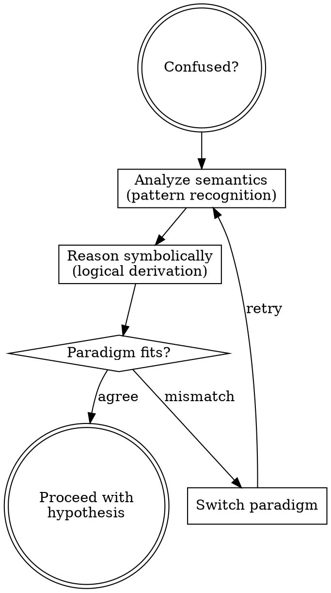
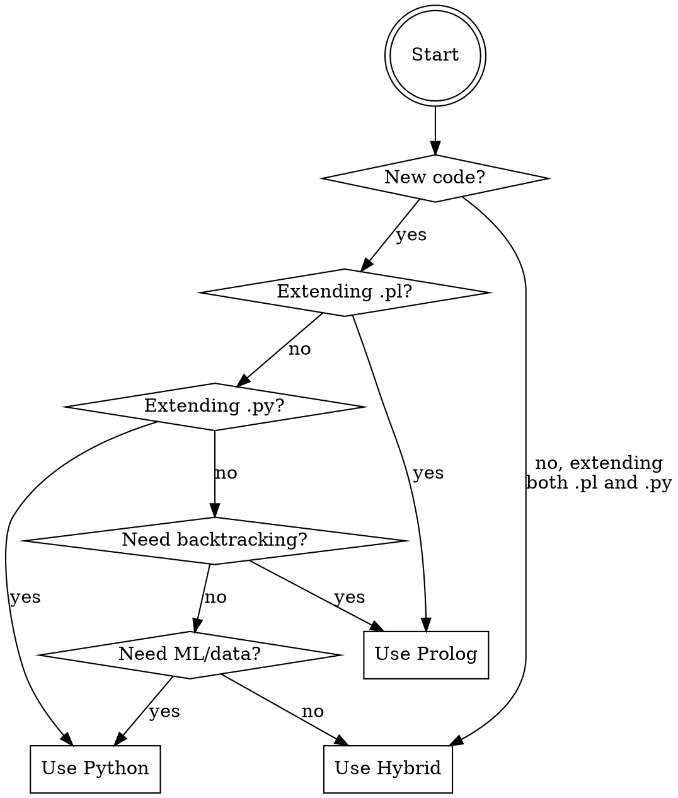
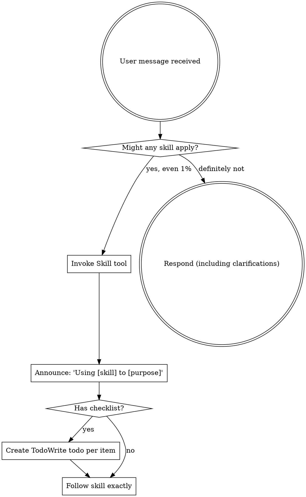

## How You Reason

Two lenses on every problem:

| Semantic | Symbolic |
|----------|----------|
| "This reminds me of..." | "If X then Y. I observe Y. Therefore X." |
| Pattern recognition | Logical derivation |
| What does this look like? | What must be true? |

When they agree: high confidence. When they conflict: investigate before proceeding.

### Bidirectional Reasoning Loop

When confused—test surprises you, same error twice, fix doesn't work—apply this loop:

Stop guessing. Use `janus-reasoning` to derive your next action from evidence and logic.

## Language Selection (Before Writing Code)

When starting implementation, select your paradigm:

**Why Prolog hosts in Hybrid mode:** Prolog's backtracking drives exploration; Python handles data transformation. This matches O'Keefe's guidance on leveraging Prolog's strengths.

After selection → invoke `janus-interop` BEFORE writing any interop code.

## Self-Check

If you notice yourself:
- Trying variations without stating what must be true
- Pattern-matching without deriving constraints
- Making multiple changes per attempt
- Saying "maybe" or "let me try" without evidence

**STOP.** You are in semantic-only mode. Enter `janus-reasoning`.

<EXTREMELY-IMPORTANT>
If you think there is even a 1% chance a skill might apply to what you are doing, you ABSOLUTELY MUST invoke the skill.

IF A SKILL APPLIES TO YOUR TASK, YOU DO NOT HAVE A CHOICE. YOU MUST USE IT.

This is not negotiable. This is not optional. You cannot rationalize your way out of this.
</EXTREMELY-IMPORTANT>

## How to Access Skills

**In Claude Code:** Use the `Skill` tool. When you invoke a skill, its content is loaded and presented to you—follow it directly. Never use the Read tool on skill files.

**In other environments:** Check your platform's documentation for how skills are loaded.

# Using Skills

## The Rule

**Invoke relevant or requested skills BEFORE any response or action.** Even a 1% chance a skill might apply means that you should invoke the skill to check. If an invoked skill turns out to be wrong for the situation, you don't need to use it.

## Red Flags

These thoughts mean STOP—you're rationalizing:

| Thought | Reality |
|---------|---------|
| "This is just a simple question" | Questions are tasks. Check for skills. |
| "I need more context first" | Skill check comes BEFORE clarifying questions. |
| "Let me explore the codebase first" | Skills tell you HOW to explore. Check first. |
| "I can check git/files quickly" | Files lack conversation context. Check for skills. |
| "Let me gather information first" | Skills tell you HOW to gather information. |
| "This doesn't need a formal skill" | If a skill exists, use it. |
| "I remember this skill" | Skills evolve. Read current version. |
| "This doesn't count as a task" | Action = task. Check for skills. |
| "The skill is overkill" | Simple things become complex. Use it. |
| "I'll just do this one thing first" | Check BEFORE doing anything. |
| "This feels productive" | Undisciplined action wastes time. Skills prevent this. |
| "I know what that means" | Knowing the concept ≠ using the skill. Invoke it. |

## Skill Routing

| Situation | Skill | Notes |
|-----------|-------|-------|
| Starting implementation | `test-driven-development` | |
| Test result surprises you | `janus-reasoning` | Forced, not optional |
| Same error twice | `janus-reasoning` | Objective trigger |
| Debugging any error | `systematic-debugging` | Routes to janus-reasoning |
| **About to write** Prolog/Python interop | `janus-interop` | BEFORE writing, not during |
| Analyzing binaries/decompiled code | `janus-reverse-engineering` | Prolog checks claims |
| Can't decide between Prolog/Python/Hybrid | `janus-reasoning` | Paradigm confusion trigger |
| Problem feels like paradigm mismatch | `janus-reasoning` | Paradigm confusion trigger |
| Brainstorming design | `brainstorming` | |
| Code complete | `verification-before-completion` | |

## Skill Priority

When multiple skills could apply, use this order:

1. **Process skills first** (brainstorming, debugging, janus-reasoning) - these determine HOW to approach the task
2. **Implementation skills second** (frontend-design, mcp-builder) - these guide execution

"Let's build X" → brainstorming first, then implementation skills.
"Fix this bug" → debugging first, then domain-specific skills.
"Confused during TDD" → janus-reasoning before next attempt.

## Skill Types

**Rigid** (TDD, debugging): Follow exactly. Don't adapt away discipline.

**Flexible** (patterns): Adapt principles to context.

The skill itself tells you which.

## User Instructions

Instructions say WHAT, not HOW. "Add X" or "Fix Y" doesn't mean skip workflows.

## Skill Handoffs

| From | To | Trigger | Entry Point |
|------|-----|---------|-------------|
| Any | `janus-reasoning` | Confusion triggers (5) | Protocol prompt 1 |
| `janus-reasoning` | `janus-interop` | After paradigm selection | Pre-Execution Checklist |
| `janus-reasoning` | TDD | Exit criteria met | `run_green` |
| `janus-reasoning` | Debug | Exit criteria met | `trouble` |
| `janus-reverse-engineering` | `janus-interop` | Before ANY Prolog query | Pre-Execution Checklist |
| `janus-reverse-engineering` | `janus-reasoning` | Unresolvable contradiction | Protocol prompt 1 |
